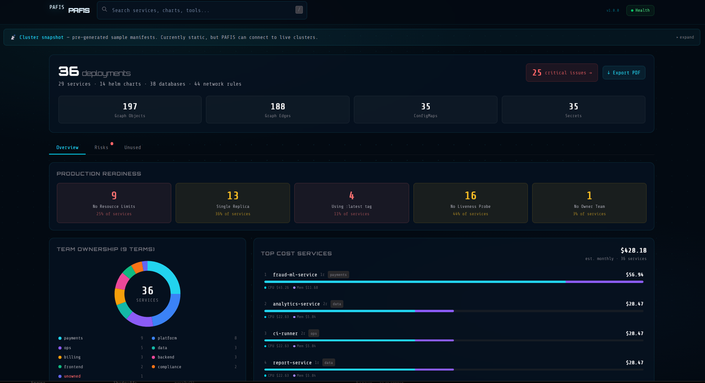
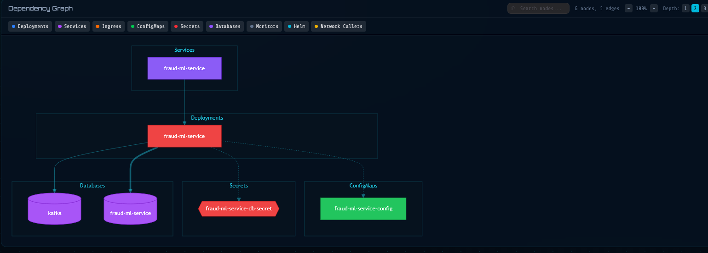
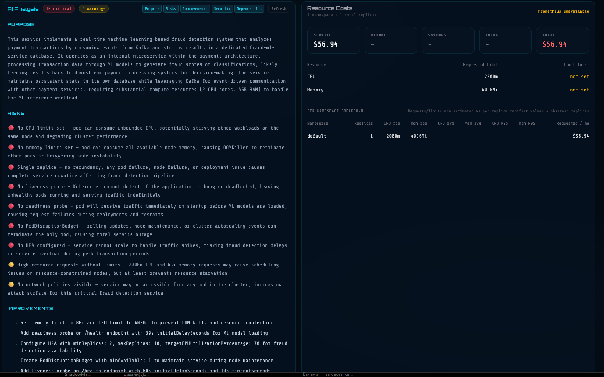

# PAFIS — Predictive Analysis For Infrastructure Services

PAFIS turns Kubernetes manifest files into an interactive intelligence layer — dependency graphs, AI-powered risk analysis, and cost estimation, with no live cluster access required.

## Screenshots




---

## What it does

PAFIS reads Kubernetes manifest files (Deployments, Services, Ingresses, ConfigMaps, Secrets, Helm Charts, ServiceMonitors) from disk, parses them into an in-memory dependency graph, and provides:

- **Dependency diagram** — interactive graph with pan/zoom, layer toggles, node search, edge tooltips, and risk-based color coding (🔴 critical / 🟡 warning / 🟢 healthy)
- **AI analysis** — 5-stage streaming analysis per service (Purpose, Risks, Improvements, Security, Dependencies) powered by Claude Sonnet via Anthropic API, with Ollama support for fully local/offline deployments
- **Risk dashboard** — global risk scoring across all services with severity filtering and click-to-navigate
- **Cost estimation** — per-service monthly cost breakdown (CPU + memory) based on approximate AWS EKS on-demand pricing, with actual vs requested comparison when Prometheus is connected
- **Top cost services** — ranked leaderboard with CPU/memory split bars
- **Team ownership** — donut chart with clickable team slices showing per-team service lists
- **Unused resource detection** — orphaned ConfigMaps, Secrets, and Services with no attached deployments
- **PDF/Markdown export** — full infrastructure report with cluster summary, risk scorecard, and team ownership
- **Health page** — `/health` endpoint showing graph status, data freshness, Prometheus connectivity, AI provider, memory usage and uptime

---

## Architecture

```
Browser (Next.js App Router)
├── Dashboard        — global stats, risk overview, team ownership, top costs
├── Service view     — dependency diagram, AI analysis, cost breakdown
├── Report (/report) — printable PDF export
└── Health (/health) — operational status page

Next.js API Routes
├── GET  /api/services      → service index with fuzzy search
├── GET  /api/graph/:name   → Mermaid subgraph for dependency diagram
├── GET  /api/manifest/:name → raw YAML + metadata
├── POST /api/analyze/:name → AI streaming analysis (5 stages)
├── GET  /api/metrics/:name → Prometheus cost data
├── GET  /api/stats         → global infrastructure stats
├── GET  /api/risks         → per-service risk scores
├── GET  /api/unused        → orphaned resource detection
├── GET  /api/topcost       → top 10 most expensive services
├── GET  /api/report-md     → Markdown export
└── GET  /api/health        → operational health check
```

---

## How data works

PAFIS is a **static snapshot tool** — it reads manifest files at startup and serves everything from memory. It does not connect to your cluster at runtime.

```
kubectl (any cluster)
       ↓
npm run fetch:minikube   # or fetch:cluster
       ↓
./data/kubernetes/       # YAML files on disk
       ↓
PAFIS parses at startup → in-memory graph → API
```

**Benefits:** works offline, air-gapped, and in CI/CD pipelines without cluster permissions at runtime.  
**Live mode:** possible via `kubectl watch` with read-only RBAC — on the roadmap.

---

## Getting started

```bash
# Clone
git clone https://github.com/Paffss/pafis.git
cd pafis

# Install
npm install

# Generate sample data (fintech/SaaS/DevOps — 40+ services)
npm run sample-data

# Configure
cp .env.local.example .env.local
# Edit .env.local — add your ANTHROPIC_API_KEY

# Run
npm run dev
# → http://localhost:3000
```

### Fetch from a real cluster

```bash
# Minikube
npm run fetch:minikube

# Any cluster (uses current kubectl context)
npm run fetch:cluster

# Specific namespace only
bash scripts/fetch-manifests.sh --context my-context --namespace production
```

---

## Configuration

| Variable | Description | Default |
|---|---|---|
| `PAFIS_BASE` | Path to manifest data directory | `./data` |
| `ANTHROPIC_API_KEY` | Claude API key ([console.anthropic.com](https://console.anthropic.com)) | — |
| `AI_PROVIDER` | `anthropic` or `ollama` | `anthropic` |
| `OLLAMA_URL` | Ollama base URL (if using local LLM) | `http://localhost:11434` |
| `OLLAMA_MODEL` | Ollama model name | `llama3` |
| `PROMETHEUS_URL` | Prometheus URL for real usage metrics | `http://localhost:9090` |
| `NEXT_PUBLIC_DATA_MODE` | `sample`, `cluster`, or `auto` | `auto` |
| `DEMO_USERNAME` | Login username | `user` |
| `DEMO_PASSWORD` | Login password | — |
| `SESSION_SECRET` | Cookie signing secret | — |

---

## Deployment

Infrastructure is managed with Terraform (AWS App Runner + ECR + Route 53 + Secrets Manager).

```bash
# First time setup
cd terraform
cp terraform.tfvars.example terraform.tfvars
# Fill in terraform.tfvars

terraform init
terraform apply

# Build and push Docker image
bash scripts/deploy.sh

# Tear down (after demo)
terraform destroy
```

CI/CD via GitHub Actions — every push to `main`:
1. Lint + type check
2. Build Next.js
3. Build Docker image → push to ECR
4. Trigger App Runner redeployment

---

## Cost estimation methodology

Costs are estimated using **approximate AWS EKS on-demand pricing** (`t3.medium`, `us-east-1`):

- CPU: `$0.031 / core-hour × 730 hours/month × replicas`
- Memory: `$0.004 / GiB-hour × 730 hours/month × replicas`

These figures are useful for **relative comparisons** between services, not precise billing. Actual cost depends on instance type, region, and pricing tier. Does not include networking, storage, or load balancer costs. Prometheus must be connected for real usage-based calculations.

---

## Tech stack

- **Frontend:** Next.js 15 (App Router), TypeScript, TailwindCSS, Mermaid
- **AI:** Anthropic Claude Sonnet, Ollama (local fallback)
- **Infra:** AWS App Runner, ECR, Route 53, Secrets Manager
- **IaC:** Terraform
- **CI/CD:** GitHub Actions
- **Observability:** Prometheus (optional)